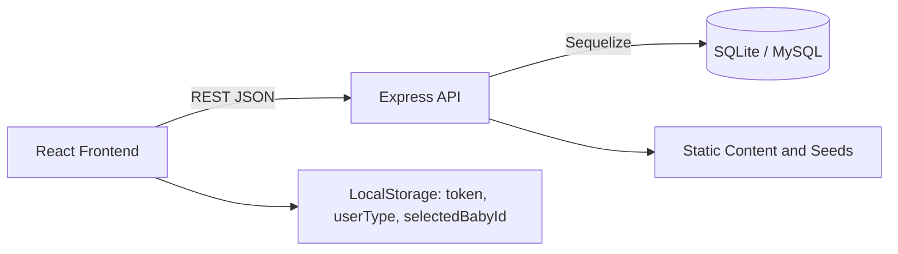
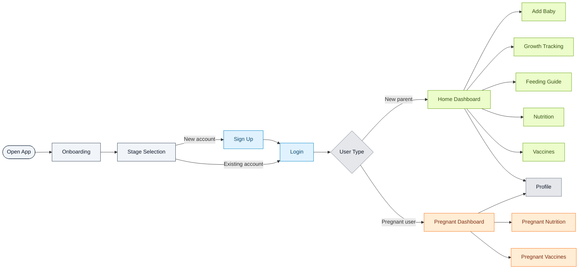
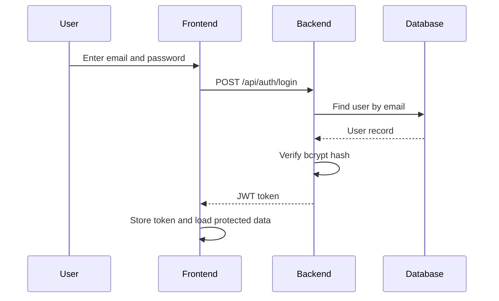

# NutriTrack Overview

NutriTrack is a full-stack health tracking application for expecting parents and families with young children. It combines a React frontend, a Node.js and Express backend, and Sequelize-powered persistence to manage onboarding, authentication, baby profiles, feeding guidance, growth tracking, vaccine reminders, and profile coordination in one workflow.

## Product Scope
- Support two primary journeys: pregnant users and new parents.
- Centralize child health workflows such as growth, feeding, vaccines, reminders, and profile management.
- Keep authentication and data access consistent through JWT-based authorization.

## Technology Stack
- Frontend: React, Vite, React Router, context state, reusable form components.
- Backend: Node.js, Express, Sequelize ORM.
- Database: SQLite by default, MySQL through `DATABASE_URL`.
- Authentication: bcrypt password hashing and JWT access tokens.

## System Architecture
The frontend renders routes and page-level UI, then talks to the backend through a single API layer. The backend validates requests, applies auth middleware, executes business logic in controllers, and persists data through Sequelize models. Static health content and schedule data are served through dedicated endpoints and seeded datasets.

## Frontend Route Map
Routes are defined in [FrontEnd/src/App.jsx](FrontEnd/src/App.jsx).

Public and entry routes
- `/onboarding` onboarding screen.
- `/welcome` stage selection.
- `/login` sign in.
- `/signup` create account.

New parent routes
- `/home` dashboard.
- `/add-baby` add baby form.
- `/nutrition` nutrition guidance.
- `/vaccines` vaccine guidance.
- `/feeding` feeding guidance.
- `/growth` growth tracking.
- `/profile` profile management.

Pregnant user routes
- `/pregnant/home` pregnant dashboard.
- `/pregnant/nutrition` pregnancy nutrition guidance.
- `/pregnant/vaccines` pregnancy vaccine and health guidance.

Fallback behavior
- `/` and unknown paths redirect to `/onboarding`.

## Backend Route Map
All API routes are mounted under `/api` in [backend/src/server.js](backend/src/server.js).

Authentication
- `POST /api/auth/register` create a user.
- `POST /api/auth/login` authenticate and issue a token.
- `GET /api/auth/me` fetch the current user.

Babies
- `GET /api/babies` list active babies.
- `POST /api/babies` create a baby profile.
- `GET /api/babies/:babyId` fetch a baby and related growth data.
- `PUT /api/babies/:babyId` update a baby profile.
- `DELETE /api/babies/:babyId` soft delete a baby.
- `GET /api/babies/:babyId/growth` list growth records for one baby.

Growth
- `GET /api/growth/records` list growth records.
- `POST /api/growth/records` create a growth record.
- `GET /api/growth/records/:recordId` fetch one record.
- `PUT /api/growth/records/:recordId` update one record.
- `DELETE /api/growth/records/:recordId` delete one record.

Reminders
- `GET /api/reminders` list reminders.
- `POST /api/reminders` create a reminder.
- `PATCH /api/reminders/:reminderId/complete` mark a reminder complete.
- `DELETE /api/reminders/:reminderId` remove a reminder.

Vaccines
- `GET /api/vaccines` list all vaccines.
- `GET /api/vaccines/mother` list vaccines for pregnant users.
- `GET /api/vaccines/:vaccineId` fetch one vaccine.
- `GET /api/vaccines/reminders/user` list vaccine reminders for the current user.
- `POST /api/vaccines/reminders` create a vaccine reminder.
- `POST /api/vaccines/reminders/cleanup` remove duplicate reminders.
- `PATCH /api/vaccines/reminders/:reminderId/status` update reminder status.
- `DELETE /api/vaccines/reminders/:reminderId` delete a vaccine reminder.

Static content
- `GET /api/static/daily-tip` daily tip content.
- `GET /api/static/nutrition-tips` nutrition advice.
- `GET /api/static/feeding-guide` feeding guide content.
- `GET /api/static/safe-foods` safe foods list.
- `GET /api/static/vaccine-schedule` vaccine schedule data.

Profile
- `GET /api/profile` fetch the user profile.
- `PUT /api/profile` update profile details.
- `POST /api/profile/emergency-contact` save an emergency contact.
- `GET /api/profile/emergency-contact` fetch the emergency contact.
- `DELETE /api/profile/emergency-contact` delete the emergency contact.
- `POST /api/profile/partner-invite` send a partner invite.
- `GET /api/profile/partner-invitations` list partner invites.
- `PATCH /api/profile/partner-invitations/:invitationId/accept` accept an invite.
- `PATCH /api/profile/partner-invitations/:invitationId/decline` decline an invite.

Feeding
- `GET /api/feedings` list feeding guidance, optionally filtered by age.
- `GET /api/feedings/:feedingId` fetch one feeding entry.

## Core Data Model
- `User` stores account identity, auth fields, and user type.
- `Baby` stores baby profile data and belongs to a user.
- `GrowthRecord` stores measurements and links to both user and baby.
- `Reminder` stores task reminders and vaccine reminders.
- `Vaccine` stores master vaccine definitions and schedule metadata.
- `Note`, `Partner`, and `EmergencyContact` support profile coordination features.

## Key Relationships
- One user can have many babies.
- One baby can have many growth records.
- One user can have many reminders and profile-linked records.
- Vaccine schedules are derived from static timing rules and stored reminder records.

## Frontend Composition
- [FrontEnd/src/main.jsx](FrontEnd/src/main.jsx) bootstraps the app and renders `App`.
- [FrontEnd/src/App.jsx](FrontEnd/src/App.jsx) wires routing and wraps the app in `BabyProvider`.
- [FrontEnd/src/api.js](FrontEnd/src/api.js) centralizes network requests, auth headers, and error handling.

### Common UI building blocks
- Auth: `AuthHeader`, `AuthFooter`, `FormInput`, `ErrorMessage`, `PasswordStrengthIndicator`.
- Baby and growth: `BabyCard`, `BabyForm`, `BabyProfileCard`, `GrowthInput`, `GrowthHeader`, `MilestoneCard`.
- Navigation and dashboard: `BottomNavigation`, `GreetingCard`, `NotificationBanner`, `NotificationCard`.
- Content pages: `NutritionCard`, `NutritionHeader`, `FeedingHeader`, `KhopCard`.

## End-to-End Flows

### 1. Onboarding and stage selection flow
1. The user opens the app.
2. The app lands on onboarding and then stage selection.
3. The user chooses a journey path: pregnant user or new parent.
4. The app routes the user into the appropriate authentication and dashboard flow.

### 2. Sign-up flow
1. The user submits the registration form.
2. The frontend validates the inputs before making the request.
3. The frontend sends `POST /api/auth/register`.
4. The backend validates password strength, checks for duplicates, hashes the password, and creates the account.
5. The user is redirected to login after success.

### 3. Login flow
1. The user submits email and password.
2. The frontend sends `POST /api/auth/login`.
3. The backend verifies credentials and returns a JWT.
4. The frontend stores the token, restores the current user, and loads protected app data.

### 4. New parent flow
1. The user signs in as a new parent.
2. The app opens the main dashboard.
3. The user adds one or more baby profiles.
4. The user moves between baby management, growth, nutrition, vaccines, feeding, and profile pages from the dashboard.

### 5. Pregnant user flow
1. The user signs in as a pregnant user.
2. The app opens the pregnant dashboard.
3. The user reviews pregnancy nutrition and pregnancy vaccine guidance.
4. The same profile and reminder infrastructure remains available behind the scenes.

### 6. Baby profile management flow
1. The user opens the add-baby form or edits an existing baby.
2. The frontend validates the baby name and birth date.
3. The frontend sends create, update, or delete requests to `/api/babies`.
4. The backend updates the database and the frontend refreshes the baby list and selected baby state.

### 7. Growth tracking flow
1. The user selects a baby and opens growth tracking.
2. The user enters measurements such as weight and height.
3. The frontend sends the growth data to `/api/growth/records`.
4. The backend stores the record and returns updated data.
5. The frontend updates charts, records, and milestone views.

### 8. Feeding and nutrition flow
1. The user opens feeding or nutrition content.
2. The frontend requests the relevant static data from the API.
3. The backend returns age-based feeding guidance and nutrition tips.
4. The UI displays structured guidance cards and reference content.

### 9. Vaccine and reminder flow
1. The frontend loads vaccine master data.
2. The app calculates due dates from the baby's birth date and the schedule rules in [FrontEnd/src/utils/vaccineSchedule.js](FrontEnd/src/utils/vaccineSchedule.js).
3. Reminder records are generated for each applicable dose.
4. The backend stores reminders and exposes them through the reminders and vaccines endpoints.
5. The user can review, complete, clean up, or delete reminders.

### 10. Profile and partner flow
1. The user opens the profile page.
2. The user updates personal profile details.
3. The user adds or removes an emergency contact.
4. The user sends, accepts, or declines partner invitations.

## Overall User Journey

## Login Sequence

## Data Storage
- SQLite is used for local and development setups by default.
- MySQL can be enabled through `DATABASE_URL`.
- Sequelize defines tables, associations, and sync behavior.

## Summary
NutriTrack is organized as a routed frontend on top of a token-protected REST API. The application supports onboarding, sign-up, login, user-type selection, new parent and pregnant dashboards, baby management, growth tracking, feeding and nutrition content, vaccine guidance, reminder automation, and profile coordination.

