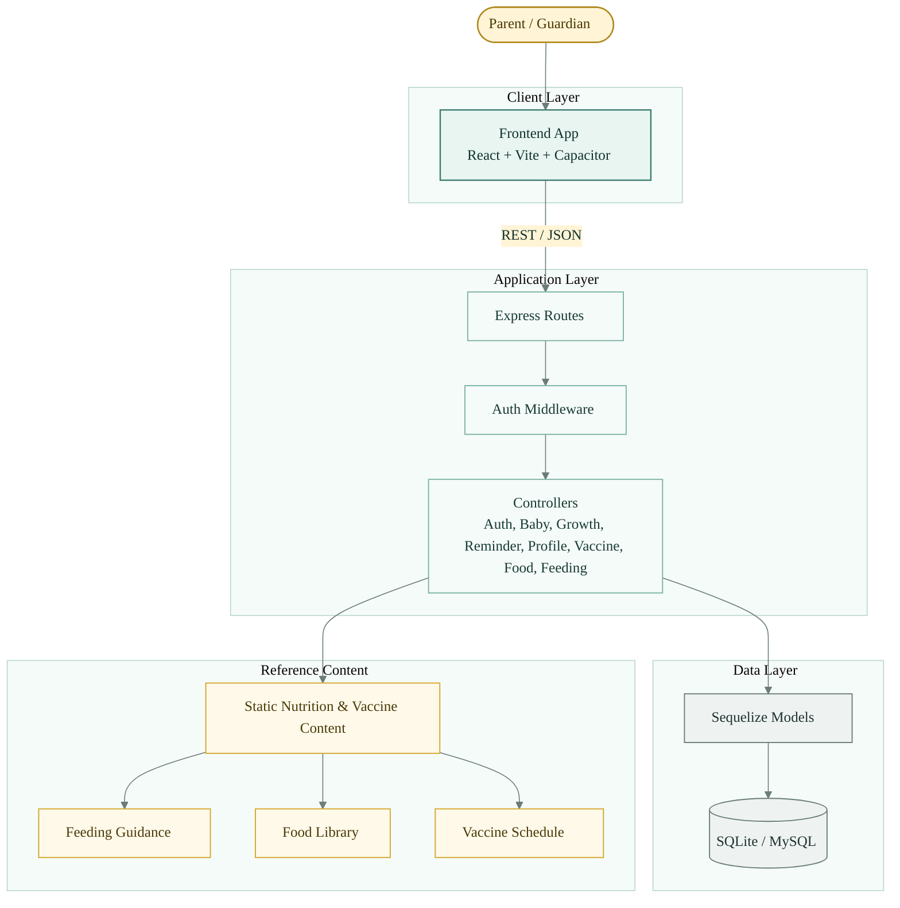
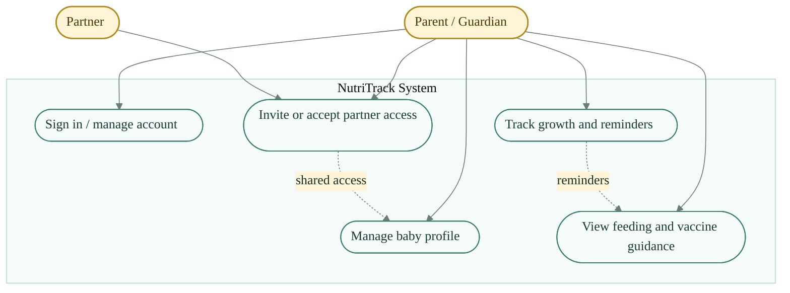
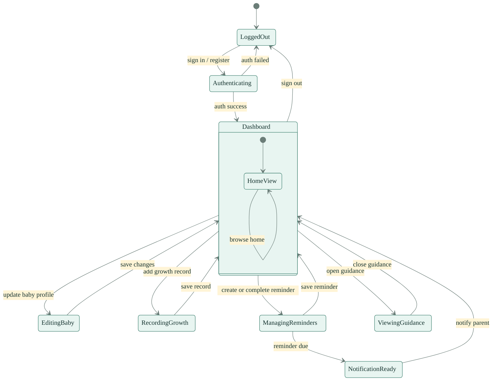
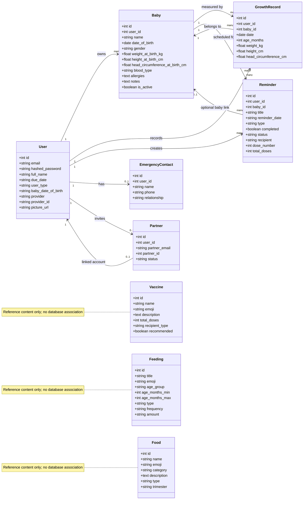
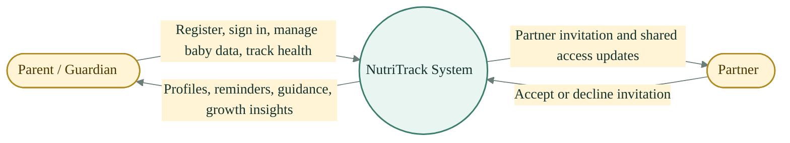
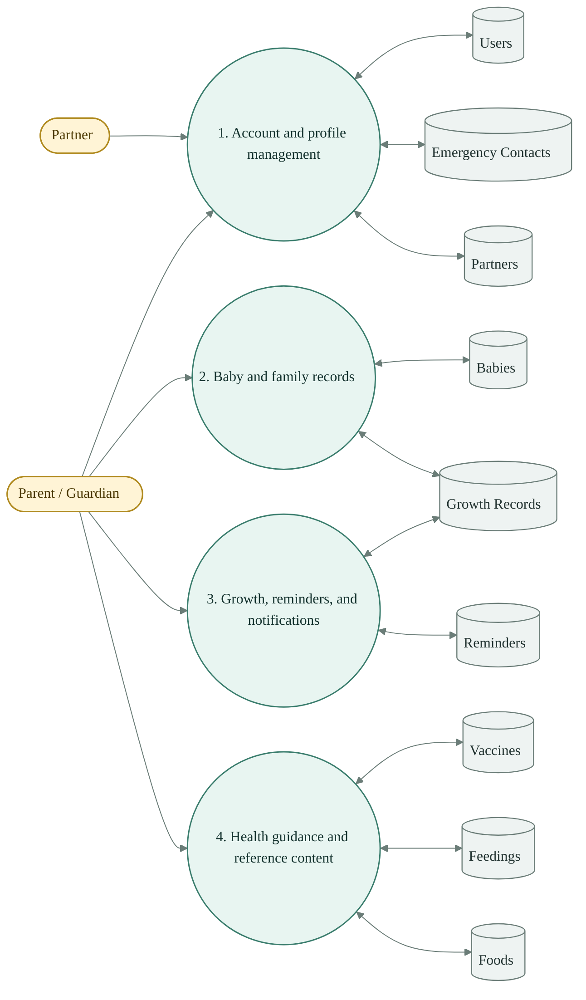
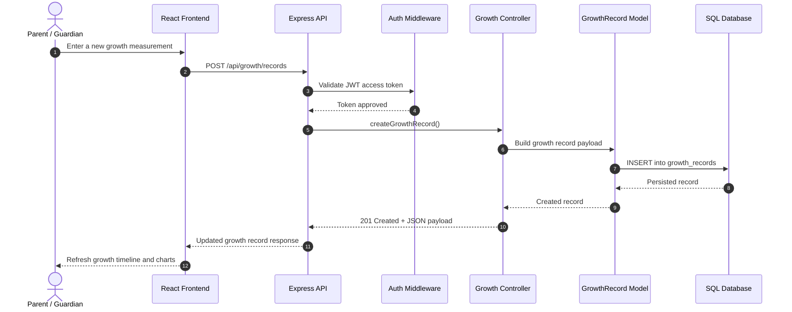

# NutriTrack System Diagrams

This document collects the main diagrams for NutriTrack in one place. The styling is intentionally clean and health-focused, with a green-and-gold palette that matches the product's nutrition and family-care theme.

## 1. Block Diagram

## 2. Scenario Based Analysis - Use Case Diagram

## 3. Behavioral Analysis - State Chart Diagram

## 4. Class Diagram

## 5. Context Diagram

## 6. Level 0 DFD

## 7. Level 1 DFD

```mermaid
%%{init: {
  "theme": "base",
  "themeVariables": {
    "fontFamily": "Inter, Segoe UI, Arial, sans-serif",
    "primaryColor": "#E8F5F1",
    "primaryTextColor": "#14322E",
    "primaryBorderColor": "#3A7D6D",
    "lineColor": "#6B7D78",
    "secondaryColor": "#FFF4D6",
    "tertiaryColor": "#F7FAF9",
    "background": "transparent"
  },
  "flowchart": { "curve": "basis" }
}}%%
flowchart LR
  Parent([Parent / Guardian])
  Partner([Partner])

  subgraph A[1.0 Account and Profile Management]
    P11((1.1 Authenticate user))
    P12((1.2 Manage profile details))
    P13((1.3 Manage emergency contact))
    P14((1.4 Manage partner invitation))
  end

  subgraph B[2.0 Baby and Family Records]
    P21((2.1 Add baby profile))
    P22((2.2 Update baby information))
    P23((2.3 Maintain family relationships))
  end

  subgraph C[3.0 Growth, Reminders, and Notifications]
    P31((3.1 Record growth measurement))
    P32((3.2 Create or update reminder))
    P33((3.3 Mark reminder complete))
    P34((3.4 Generate user notification))
  end

  subgraph D[4.0 Health Guidance and Reference Content]
    P41((4.1 Retrieve vaccine guidance))
    P42((4.2 Retrieve feeding guidance))
    P43((4.3 Retrieve food guidance))
  end

  D1[(Users)]
  D2[(Babies)]
  D3[(Growth Records)]
  D4[(Reminders)]
  D5[(Emergency Contacts)]
  D6[(Partners)]
  D7[(Vaccines)]
  D8[(Feedings)]
  D9[(Foods)]

  Parent --> P11
  Parent --> P12
  Parent --> P13
  Parent --> P14
  Parent --> P21
  Parent --> P22
  Parent --> P23
  Parent --> P31
  Parent --> P32
  Parent --> P33
  Parent --> P41
  Parent --> P42
  Parent --> P43
  Partner --> P14

  P11 <--> D1
  P12 <--> D1
  P13 <--> D5
  P14 <--> D6

  P21 <--> D2
  P22 <--> D2
  P23 <--> D6

  P31 <--> D3
  P32 <--> D4
  P33 <--> D4
  P34 <--> D4

  P41 <--> D7
  P42 <--> D8
  P43 <--> D9

  classDef actor fill:#FFF4D6,stroke:#B08A1F,color:#4A3700,stroke-width:1.5px;
  classDef process fill:#E8F5F1,stroke:#3A7D6D,color:#14322E,stroke-width:1.5px;
  classDef store fill:#EEF3F2,stroke:#6B7D78,color:#20312F,stroke-width:1.2px;
  classDef group fill:#F7FAF9,stroke:#B8D6CF,color:#183B35,stroke-width:1px,stroke-dasharray:4 3;

  class Parent,Partner actor;
  class P11,P12,P13,P14,P21,P22,P23,P31,P32,P33,P34,P41,P42,P43 process;
  class D1,D2,D3,D4,D5,D6,D7,D8,D9 store;
  class A,B,C,D group;
```

## 8. Sequence Diagram

## Notes

- The backend can run on SQLite in local development or MySQL in production-like deployments.
- The diagrams emphasize the project’s actual domain objects and API flows rather than generic placeholders.
- Mermaid rendering will look best in a Markdown viewer that supports the class, flowchart, state, and sequence diagram syntax used above.